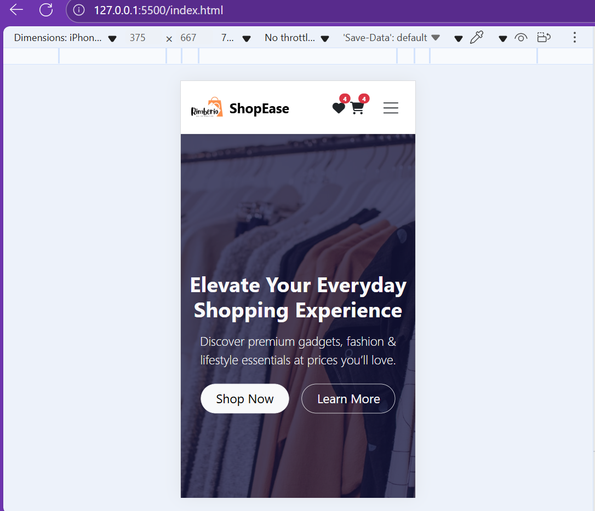
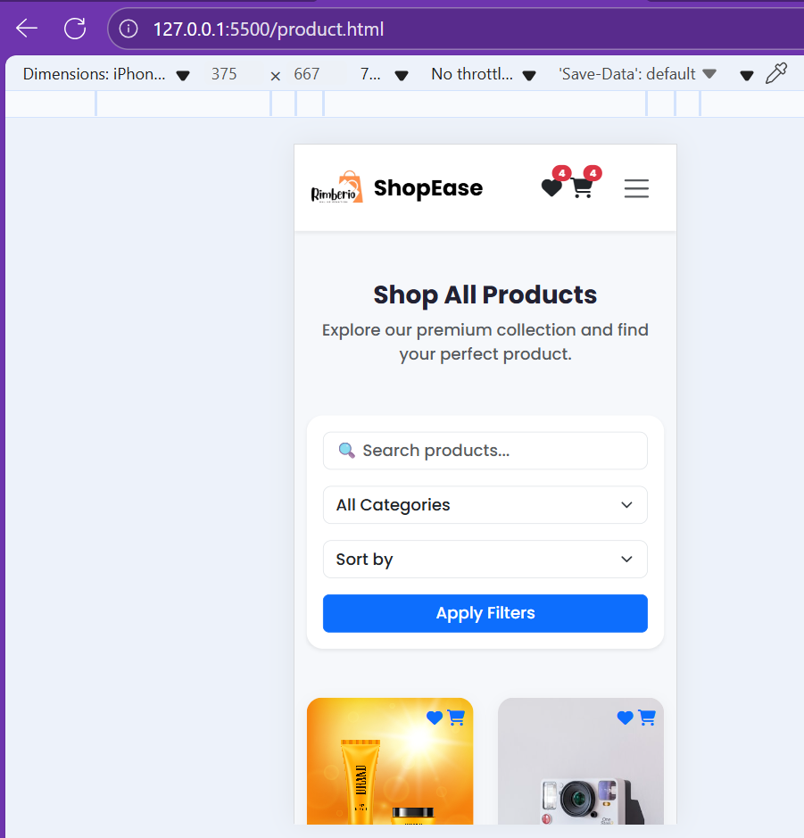
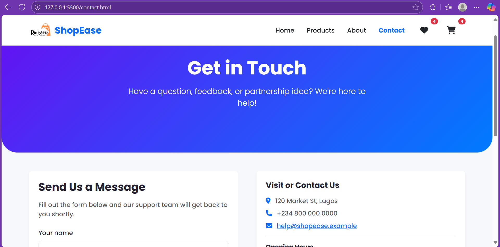
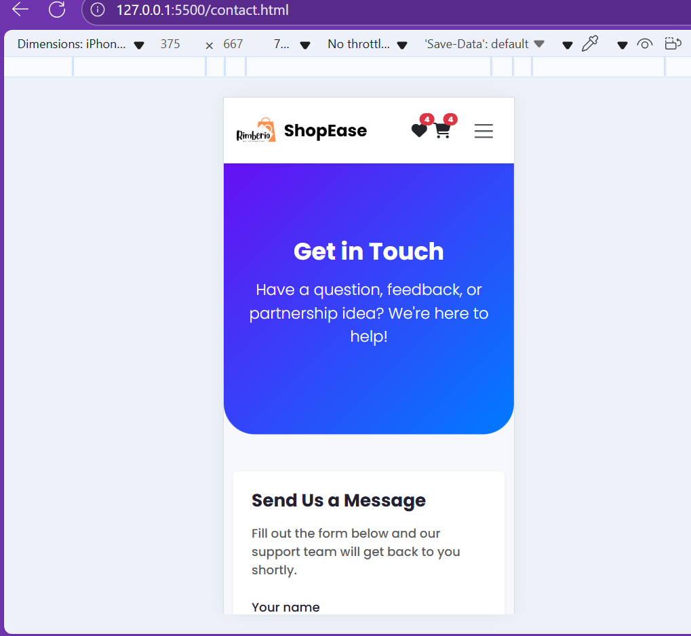
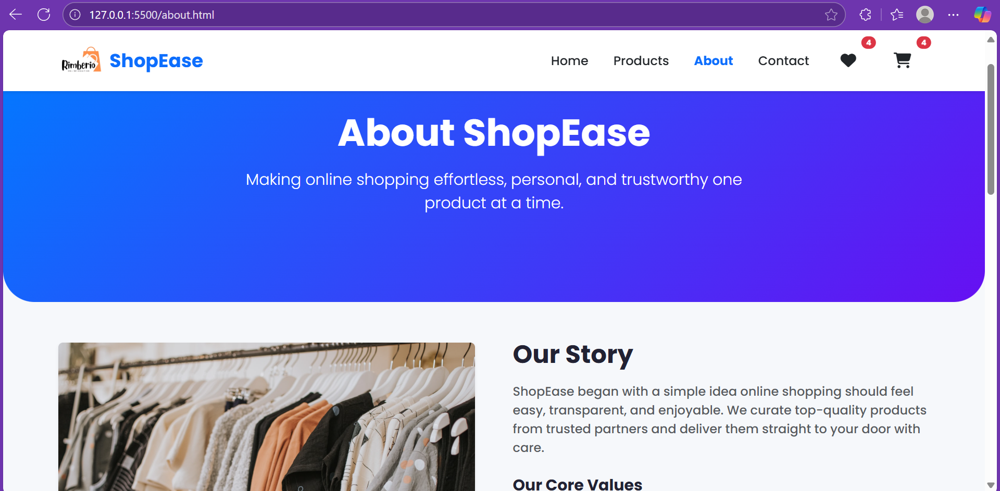
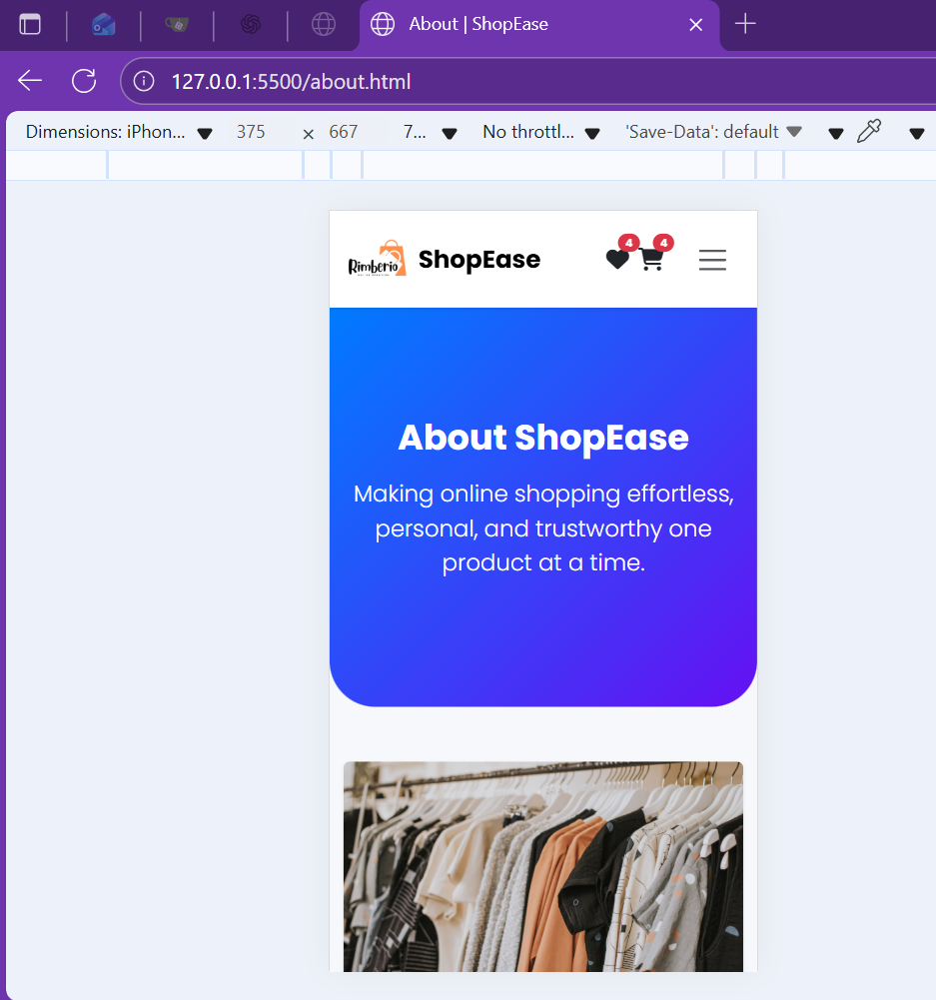
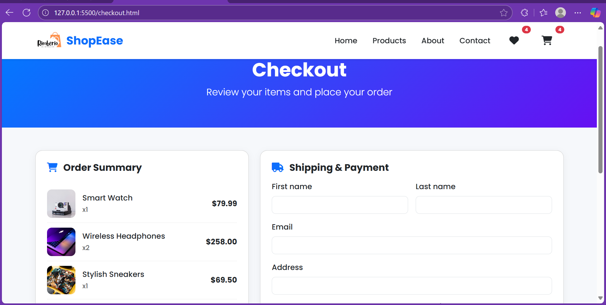
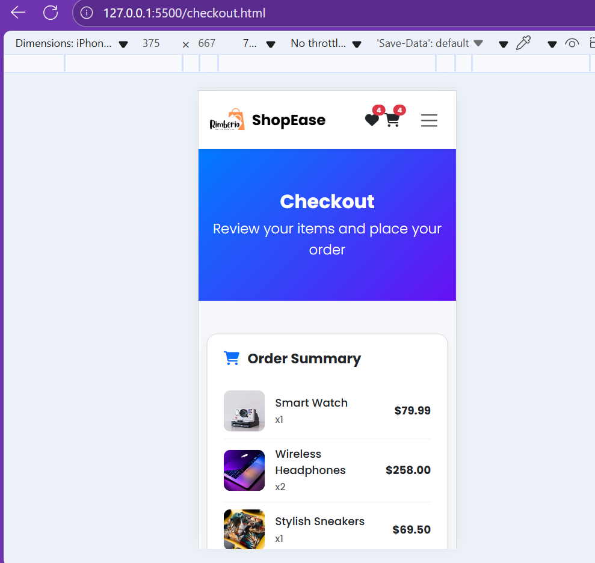
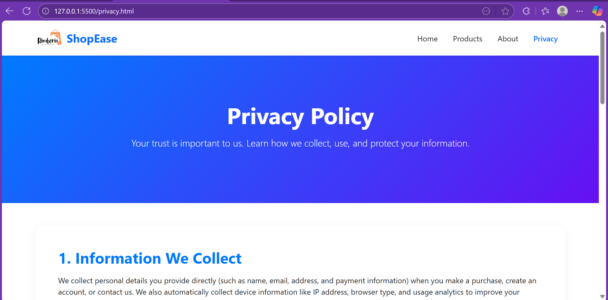
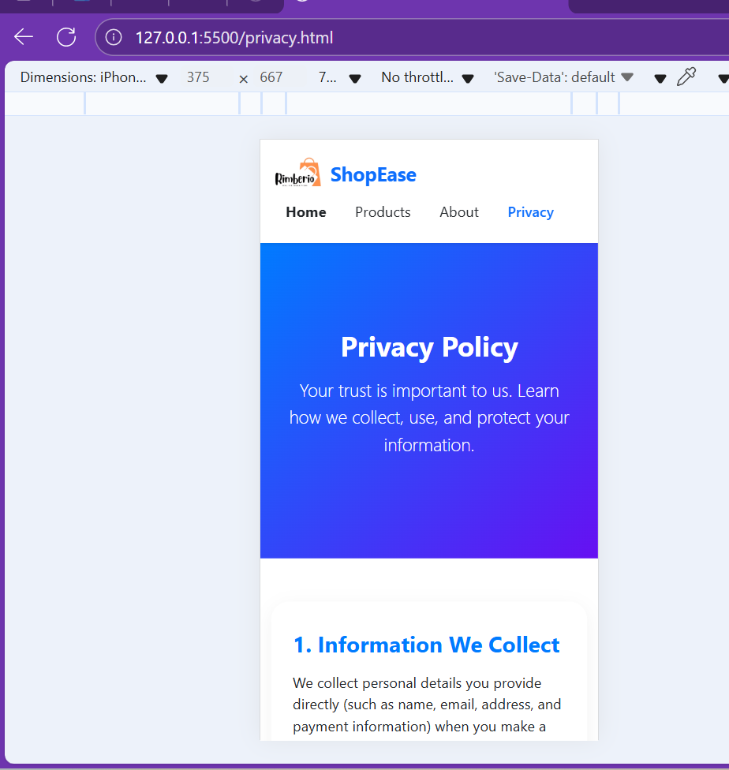

# ShopEase – Online Store Website

**ShopEase** is a modern, responsive eCommerce website built using **HTML5**, **CSS3**, and **Bootstrap 5**.  
It showcases a clean interface for browsing products, viewing categories, and contacting the store — all without requiring backend functionality.

This project is designed as part of a **web development assignment** to demonstrate front-end web design and Bootstrap integration.

---

## Project Information

**Project Title:** ShopEase – Online Store  
**Author:** [Esther-Ola]  
**Course:** [Software Engineering]

---

## Project Overview

ShopEase is a simple, user-friendly online shopping website.  
It includes multiple pages such as the homepage, product listings, about page, contact form, checkout page, and **privacy policy** — all fully responsive across devices.

The design focuses on **ease of use**, **visual appeal**, and **structured navigation** using **Bootstrap components** and **custom CSS styling**.

---

## Website Pages

| Page         | File            | Description                                                                                      |
| ------------ | --------------- | ------------------------------------------------------------------------------------------------ |
| **Home**     | `index.html`    | Main landing page with hero banner, categories, featured products, testimonials, and newsletter. |
| **Products** | `product.html`  | Displays available products in a grid layout with price and "Add to Cart" options.               |
| **About**    | `about.html`    | Provides company background, mission, and values.                                                |
| **Contact**  | `contact.html`  | Includes a contact form, business details, and Google Maps location.                             |
| **Wishlist** | `wishlist.html` | Shows saved favorite products.                                                                   |
| **Checkout** | `checkout.html` | Displays cart items and checkout summary.                                                        |
| **Privacy**  | `privacy.html`  | Contains privacy policy details and user data protection information.                            |

---

## Key Features

### General

- Fully responsive and mobile-friendly layout
- Clean UI with consistent typography and color scheme
- Navbar and footer appear on all pages for easy navigation
- Interactive hover effects and call-to-action buttons

### Homepage

- Hero section with a strong marketing message
- “Shop by Category” section featuring icons and categories
- Featured Products grid with images, names, and prices
- Testimonial carousel using Bootstrap’s slider component
- Newsletter subscription form
- Promotional banner for discounts or offers

### Products Page

- Product cards with images, names, and prices
- Add to cart and wishlist icons
- Bootstrap grid system for responsiveness

### Contact Page

- Contact form with name, email, and message fields
- Embedded Google Maps for store location
- Business contact details and social links

### Checkout / Wishlist / Privacy

- Well-structured placeholder pages ready for backend integration
- Consistent design and styling across pages

---

## Technologies Used

| Technology                 | Purpose                                        |
| -------------------------- | ---------------------------------------------- |
| **HTML5**                  | Website structure and semantic elements        |
| **CSS3**                   | Custom styling and layout design               |
| **Bootstrap 5.3.3**        | Responsive grid system and ready UI components |
| **Font Awesome 6.6.0**     | Icons for cart, heart, and social media        |
| **Google Fonts (Poppins)** | Clean, modern typography                       |
| **Google Maps Embed**      | Location display on contact page               |

---

## Custom CSS (`style.css`)

A custom `style.css` file enhances branding and design with:

- Gradient text headings
- Hero and promotional banners
- Product card hover animations
- Category icons and newsletter styles
- Footer design and link effects

Example snippet:

```css
.text-gradient {
  background: linear-gradient(90deg, #0d6efd, #6610f2);
  -webkit-background-clip: text;
  -webkit-text-fill-color: transparent;
}

.hero-section {
  background: url("./images/hero-bg.jpg") center/cover no-repeat;
  height: 90vh;
}
How to Run the Project
Download or clone the project folder

bash
Copy code
git clone https://github.com/yourusername/shopease.git
Open the folder

bash
Copy code
cd shopease
Launch the website

Double-click index.html
OR

Use VS Code Live Server for auto-refresh and quick preview

No backend setup required all pages are static HTML/CSS.

Responsiveness
The site uses Bootstrap’s grid and flex utilities to ensure full responsiveness across:

Desktop screens

Laptops & tablets

Mobile phones

Project Screenshots
<div align="center">
Home Page
<table> <tr> <td align="center"><b>Desktop View</b></td> <td align="center"><b>Mobile View</b></td> </tr> <tr> <td></td> <td></td> </tr> </table>
Products Page
<table> <tr> <td align="center"><b>Desktop View</b></td> <td align="center"><b>Mobile View</b></td> </tr> <tr> <td></td> <td></td> </tr> </table>
Contact Page
<table> <tr> <td align="center"><b>Desktop View</b></td> <td align="center"><b>Mobile View</b></td> </tr> <tr> <td></td> <td></td> </tr> </table>
About Page
<table> <tr> <td align="center"><b>Desktop View</b></td> <td align="center"><b>Mobile View</b></td> </tr> <tr> <td></td> <td></td> </tr> </table>
Checkout Page
<table> <tr> <td align="center"><b>Desktop View</b></td> <td align="center"><b>Mobile View</b></td> </tr> <tr> <td></td> <td></td> </tr> </table>
Privacy Page
<table> <tr> <td align="center"><b>Desktop View</b></td> <td align="center"><b>Mobile View</b></td> </tr> <tr> <td></td> <td></td> </tr> </table> </div>

Author
Developed by: [Esther-Ola]

License
This project is for educational purposes only.
All design and code were written manually using HTML, CSS, and Bootstrap 5.
```
